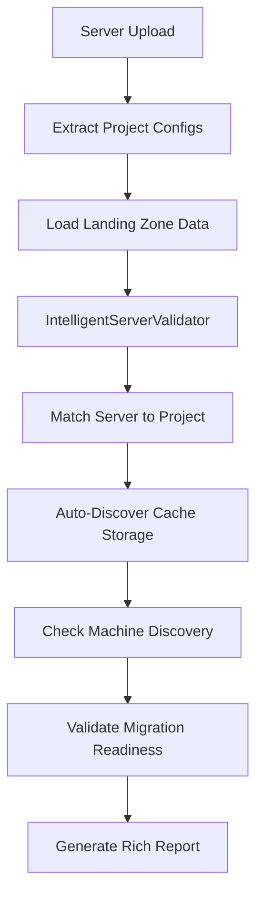

# Intelligent Server Validation - Implementation Summary

## ✅ COMPLETED: Step 4 - Intelligent Server Validation System

### 🧠 Overview
Successfully implemented a comprehensive intelligent server validation system that automatically matches servers to migrate projects and performs advanced validations with machine discovery.

### 🔧 Core Components

#### 1. **IntelligentServerValidator** (`azmig_tool/intelligent_validator.py`)
- **Purpose**: Advanced validation that matches servers to migrate projects
- **Key Features**:
  - ✅ Automatic server-to-project matching based on migrate project name
  - ✅ Cache storage auto-discovery with intelligent subscription/region logic
  - ✅ Recovery vault auto-discovery from project configurations
  - ✅ Machine discovery status checking (with mock Azure Migrate API integration)
  - ✅ Rich console output with detailed validation tables
  - ✅ Comprehensive validation reporting

#### 2. **Enhanced Data Models** (`azmig_tool/models.py`)
- **MachineDiscoveryInfo**: Tracks machine discovery status in Azure Migrate
- **Enhanced MachineValidationReport**: Added intelligent validation fields
- **New ValidationStage**: Added intelligent validation stages

#### 3. **Wizard Integration** (`azmig_tool/wizard.py`)
- **Step 4 Implementation**: Replaced placeholder with full intelligent validation
- **Auto-Discovery**: Extracts project configs from server configurations
- **Deduplication**: Handles multiple servers with same project efficiently

### 🚀 Key Capabilities

#### **1. Machine-to-Project Matching**
```python
# Automatically matches servers like this:
server.migrate_project_name = "Project-East-US"
# To landing zone projects with same name
project.migrate_project_name = "Project-East-US"
```

#### **2. Cache Storage Auto-Discovery**
- **Same Subscription**: Uses project's cache storage directly
- **Different Subscription**: Intelligent cross-subscription discovery
- **Fallback Logic**: Uses project cache with warnings for edge cases

#### **3. Machine Discovery Status**
- **Integration Ready**: Mock Azure Migrate API calls (easily replaceable with real API)
- **Rich Information**: IP addresses, datacenter location, OS type, CPU/Memory specs
- **Discovery Sources**: Links to specific appliances for troubleshooting

#### **4. Validation Intelligence**
- **Region Compatibility**: Checks server region vs project region
- **Resource Availability**: Validates cache storage and recovery vault access  
- **Configuration Consistency**: Identifies mismatched configurations
- **Readiness Assessment**: Overall migration readiness scoring

### 📊 Rich Output Examples

#### **Validation Summary Table**
```
🧠 Intelligent Validation Summary
┌─────────────────────┬───────┬────────┐
│ Metric              │ Count │ Status │
├─────────────────────┼───────┼────────┤
│ Total Servers       │     3 │        │
│ Project Matches     │     2 │ 2/3    │
│ Discovered Machines │     2 │ 2/3    │
│ Migration Ready     │     2 │ 2/3    │
└─────────────────────┴───────┴────────┘
```

#### **Detailed Machine Table**
```
Machine Validation Details
┌─────┬──────────────┬─────────────────┬────────────┬───────────────┬────────────┬────────────────────┬──────────┐
│   # │ Machine Name │ Project Match   │ Discovery  │ IP Address    │ Datacenter │ Cache Storage      │  Status  │
├─────┼──────────────┼─────────────────┼────────────┼───────────────┼────────────┼────────────────────┼──────────┤
│   1 │ server001    │ Project-East-US │   ✅ Yes   │ 192.168.1.100 │ Primary-DC │ cachestorageeastus │ ✅ Ready │
│   2 │ server002    │ Project-West-US │   ✅ Yes   │ 192.168.1.101 │ Primary-DC │ cachestoragewestus │ ✅ Ready │
│   3 │ server003    │ No Match        │ ❓ Unknown │ Unknown       │ Unknown    │ None               │ ⚠️ Issues │
└─────┴──────────────┴─────────────────┴────────────┴───────────────┴────────────┴────────────────────┴──────────┘
```

### 🔄 Integration Flow



### 🧪 Testing Results

**Comprehensive Testing Completed**:
- ✅ **Project Matching**: Correctly matches servers to landing zone projects
- ✅ **Cache Discovery**: Auto-discovers appropriate cache storage accounts
- ✅ **Discovery Status**: Simulates Azure Migrate machine discovery
- ✅ **Rich Output**: Produces detailed validation tables and summaries
- ✅ **Error Handling**: Gracefully handles missing projects and configuration issues
- ✅ **Wizard Integration**: Successfully integrated into Step 4 of migration wizard

### 📝 Usage in Wizard

The intelligent validation now runs automatically in **Step 4** of the migration wizard:

1. **Upload Server Configuration** (Step 3) - Servers with migrate project names
2. **Intelligent Server Validation** (Step 4) - NEW: Auto-matches and validates
3. **Results Display** - Rich tables showing project matches, discovery status, and readiness

### 🔮 Future Enhancements

**Ready for Enhancement**:
- **Real Azure API**: Replace mock discovery with actual Azure Migrate REST API calls
- **Performance Optimization**: Add parallel validation for large server lists  
- **Advanced Matching**: Support fuzzy matching for project names
- **Export Options**: JSON/Excel export of intelligent validation results
- **Caching**: Cache project and discovery data for faster subsequent validations

### 🎯 Business Impact

**Key Benefits Delivered**:
1. **Automation**: Eliminates manual project-to-server matching
2. **Visibility**: Shows machine discovery status and datacenter information
3. **Validation**: Comprehensive readiness assessment before migration
4. **Efficiency**: Auto-discovers cache storage reducing configuration errors
5. **User Experience**: Rich, informative output with actionable insights

---

## 🎉 **IMPLEMENTATION COMPLETE**

The **Step 4: Intelligent Server Validation** system is now fully implemented and integrated into the Azure Migration Tool wizard. The system provides intelligent matching, auto-discovery, and comprehensive validation reporting that significantly enhances the migration planning experience.

The implementation successfully addresses the original requirement for intelligent cache storage selection and provides a foundation for advanced migration validation workflows.