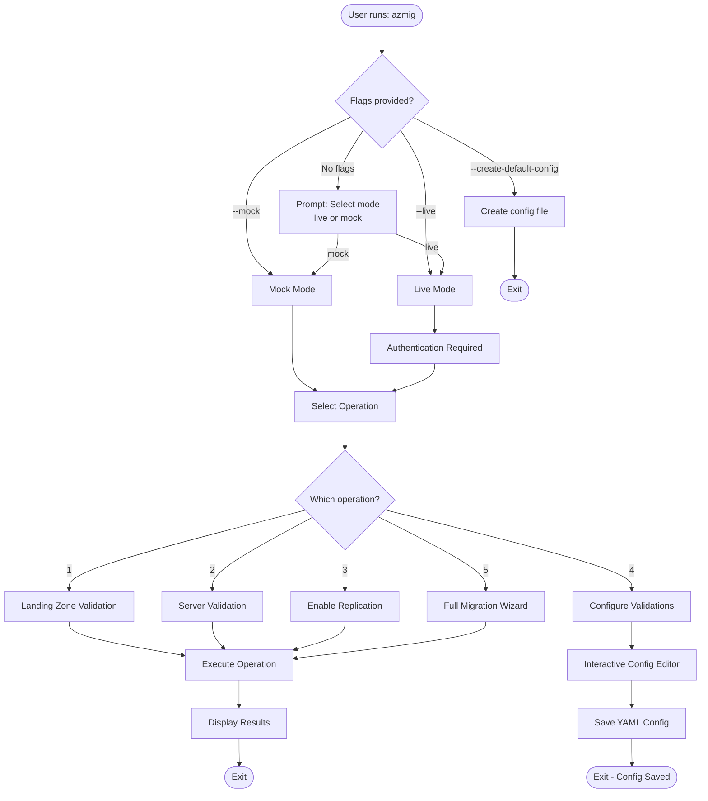
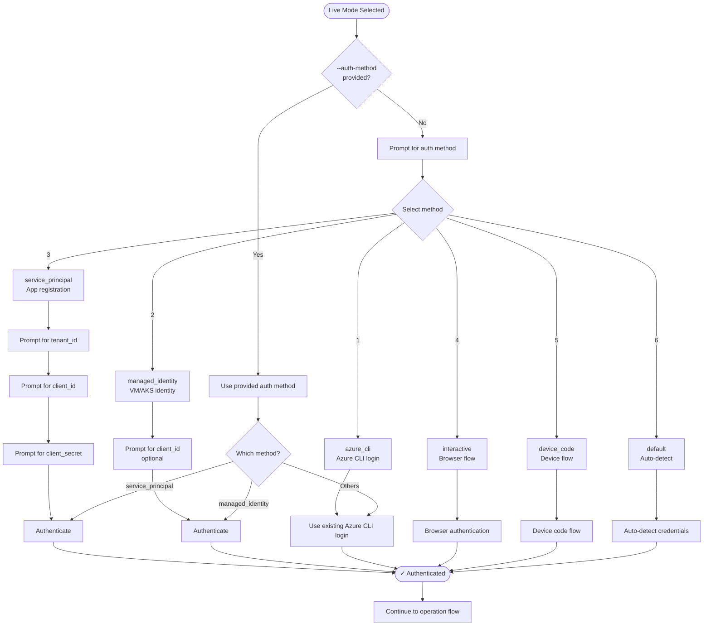
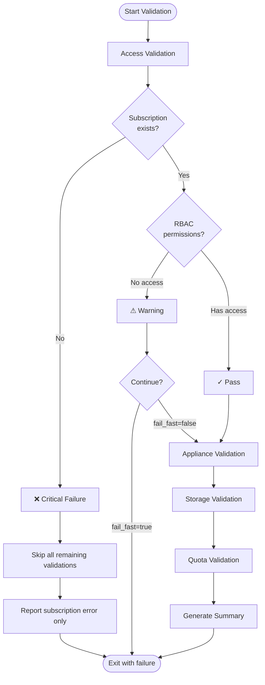

# Azure Bulk Migration Tool - Complete User Guide

> **Comprehensive documentation covering features, interactive workflows, and visual diagrams**

---

## Table of Contents

### 📖 Getting Started
1. [Overview](#overview)
2. [Key Features](#key-features)
3. [Installation](#installation)
4. [Quick Start](#quick-start)

### 🎯 Core Concepts
5. [Operation Types](#operation-types)
6. [Authentication Methods](#authentication-methods)
7. [Validation System](#validation-system)
8. [Configuration Files](#configuration-files)

### 🔄 Interactive Workflows
9. [Main Menu Flow](#main-menu-flow)
10. [Landing Zone Validation](#landing-zone-validation-workflow)
11. [Server Validation](#server-validation-workflow)
12. [Full Migration Wizard](#full-migration-wizard-workflow)
13. [Configure Validations](#configure-validations-workflow)

### 📊 Visual Diagrams
14. [Flowcharts](#flowcharts)
15. [Sequence Diagrams](#sequence-diagrams)

### 🔧 Advanced Usage
16. [Mock vs Live Modes](#mock-vs-live-modes)
17. [Validation Profiles](#validation-profiles)
18. [File Formats](#file-formats)
19. [Error Handling](#error-handling)

### 📚 Reference
20. [Command Line Options](#command-line-options)
21. [File Templates](#file-templates)
22. [Troubleshooting](#troubleshooting)

---

## Overview

The Azure Bulk Migration Tool is a comprehensive CLI solution for migrating servers to Azure using Azure Migrate and Azure Site Recovery. It features:

- **Intelligent two-layer validation** for Landing Zones and Servers
- **Five operation types** from quick validation to full migration
- **Six authentication methods** for maximum flexibility
- **Interactive wizard** with guided prompts
- **Fail-fast validation** to catch issues early
- **Mock mode** for offline testing and development
- **Rich console output** with tables and visual feedback

### Architecture Layers

```
┌─────────────────────────────────────────────────────┐
│           Layer 1: Landing Zone Validation          │
│  (Azure Migrate Project, Appliances, Storage, RBAC) │
└─────────────────────────────────────────────────────┘
                         ↓
┌─────────────────────────────────────────────────────┐
│            Layer 2: Server Validation               │
│    (Region, VNet, SKU, Disks, Discovery, RBAC)     │
└─────────────────────────────────────────────────────┘
                         ↓
┌─────────────────────────────────────────────────────┐
│             Layer 3: Enable Replication             │
│          (Initiate migration for servers)           │
└─────────────────────────────────────────────────────┘
```

---

## Key Features

### 🎯 **Five Operation Types**

1. **Landing Zone Validation** - Validate Azure Migrate project readiness
2. **Server Validation** - Validate individual server configurations
3. **Enable Replication** - Start server replication
4. **Configure Validations** - Interactive validation configuration editor
5. **Full Migration Wizard** - Complete end-to-end workflow

### 🔐 **Six Authentication Methods**

| Method | Use Case | Best For |
|--------|----------|----------|
| **Azure CLI** | Development | Local development with `az login` |
| **Managed Identity** | Production | Azure VMs, App Services, AKS |
| **Service Principal** | Automation | CI/CD pipelines, scripts |
| **Interactive Browser** | Manual | One-time operations |
| **Device Code** | Remote | SSH sessions, cloud shells |
| **Default Chain** | Auto-detect | Flexible environments |

### ✅ **Comprehensive Validation Checks**

**Landing Zone Validations:**
- ✓ Subscription access and permissions
- ✓ Azure Migrate project existence
- ✓ Appliance health and connectivity
- ✓ Cache storage account validation
- ✓ vCPU quota availability
- ✓ RBAC permissions (Contributor, Reader)

**Server Validations:**
- ✓ Target region validation
- ✓ Resource group existence
- ✓ VNet and subnet availability
- ✓ VM SKU compatibility
- ✓ Disk type support
- ✓ Server discovery status
- ✓ Required RBAC permissions

### 🎨 **Rich User Experience**

- Interactive prompts with intelligent defaults
- Color-coded status indicators (✓/✗)
- Progress tables and summaries
- File template suggestions
- Helpful error messages with guidance
- **Fail-fast validation** - stops when critical issues detected

---

## Installation

### Prerequisites

- Python 3.8 or higher
- Azure subscription
- Azure CLI (optional, for azure_cli auth)

### Install from PyPI

```bash
pip install azmig-tool
```

### Install from Source

```bash
git clone <repository-url>
cd azmig_tool_package
pip install -e .
```

### Verify Installation

```bash
azmig --help
```

---

## Quick Start

### 1. Create Default Validation Config

```bash
azmig --create-default-config
```

This creates `validation_config.yaml` with sensible defaults.

### 2. Run in Mock Mode (Offline Testing)

```bash
azmig --mock
```

Select an operation and follow the prompts.

### 3. Run in Live Mode (Azure Connection)

```bash
azmig --live
```

Authenticate to Azure and proceed with your operation.

### 4. Non-Interactive Mode

```bash
# Landing Zone validation
azmig --live \
  --operation lz_validation \
  --lz-file landing_zones.csv \
  --auth-method azure_cli

# Server validation  
azmig --live \
  --operation server_validation \
  --excel servers.xlsx \
  --auth-method azure_cli
```

---

## Operation Types

### 1. Landing Zone Validation

**Purpose:** Validate Azure Migrate project readiness before migrating servers.

**What it validates:**
- Subscription access
- Azure Migrate project configuration
- Appliance health
- Cache storage accounts
- vCPU quotas
- RBAC permissions

**When to use:**
- Before starting a new migration project
- When setting up new Azure Migrate environments
- To verify infrastructure readiness

**Input:** CSV or JSON file with Landing Zone configurations

**Output:** Validation report with pass/fail status for each check

### 2. Server Validation

**Purpose:** Validate individual server migration configurations.

**What it validates:**
- Target region availability
- Resource group existence
- VNet and subnet configuration
- VM SKU compatibility
- Disk types
- Server discovery status
- Migration permissions

**When to use:**
- After Landing Zone validation passes
- Before enabling replication
- To verify server-specific requirements

**Input:** Excel file with server configurations

**Output:** Validation report for each server

### 3. Enable Replication

**Purpose:** Initiate replication for validated servers.

**Prerequisites:**
- Landing Zone validation passed
- Server validation passed
- Servers discovered in Azure Migrate

**When to use:**
- After all validations complete successfully
- Ready to start actual migration

**Input:** Excel file with validated servers

**Output:** Replication status for each server

### 4. Configure Validations

**Purpose:** Interactively create or edit validation configuration.

**Features:**
- Toggle individual validation checks
- Configure retry settings
- Set fail-fast behavior
- Define validation profiles
- Save custom configurations

**When to use:**
- First-time setup
- Customizing validation behavior
- Creating environment-specific profiles

**Output:** `validation_config.yaml` file

### 5. Full Migration Wizard

**Purpose:** Complete end-to-end migration workflow.

**Phases:**
1. Landing Zone validation
2. Server validation
3. Enable replication

**When to use:**
- Complete migration projects
- When all prerequisites are met
- Production migrations

**Input:** Landing Zone file + Server Excel file

**Output:** Comprehensive migration report

---

## Authentication Methods

### 1. Azure CLI (`azure_cli`)

Uses existing Azure CLI credentials from `az login`.

**Setup:**
```bash
az login
```

**Usage:**
```bash
azmig --live --auth-method azure_cli
```

**Best for:** Local development, quick testing

### 2. Managed Identity (`managed_identity`)

Uses the Azure VM or service's managed identity.

**Setup:** Enable managed identity on your Azure VM/App Service

**Usage:**
```bash
azmig --live --auth-method managed_identity
```

**Best for:** Production environments, Azure-hosted workloads

### 3. Service Principal (`service_principal`)

Uses app registration credentials.

**Setup:** Create service principal in Azure AD

**Usage:**
```bash
azmig --live \
  --auth-method service_principal \
  --tenant-id <tenant-id> \
  --client-id <client-id> \
  --client-secret <secret>
```

**Best for:** CI/CD pipelines, automation

### 4. Interactive Browser (`interactive`)

Opens browser for authentication.

**Usage:**
```bash
azmig --live --auth-method interactive
```

**Best for:** One-time operations, manual runs

### 5. Device Code (`device_code`)

Provides a code to enter in browser.

**Usage:**
```bash
azmig --live --auth-method device_code
```

**Best for:** SSH sessions, cloud shells, restricted environments

### 6. Default Chain (`default`)

Auto-detects available credentials in this order:
1. Environment variables
2. Managed identity
3. Azure CLI
4. Interactive browser

**Usage:**
```bash
azmig --live --auth-method default
```

**Best for:** Flexible environments, development

---

## Validation System

### Fail-Fast Behavior

The validation system implements **intelligent fail-fast** logic:

**Critical Failures (Stops Immediately):**
- ❌ Subscription not found
- ❌ No subscription access
- ❌ Authentication failures

**Non-Critical Issues (Continues with warnings):**
- ⚠️ Missing RBAC permissions (can be granted later)
- ⚠️ Appliance health warnings
- ⚠️ Storage account missing (can be created)
- ⚠️ Quota warnings (can request increase)

**Example:**

**Before fail-fast:**
```
✗ Overall Status: FAILED
│ Access (RBAC)    │   ✓    │ All permissions validated              │
│ Appliance Health │   ✗    │ Error... object has no attribute...    │
│ Storage Cache    │   ✗    │ Storage account not found              │
│ Quota            │   ✗    │ SubscriptionNotFound...                │
```

**After fail-fast:**
```
✗ Overall Status: FAILED
│ Access (RBAC)    │   ✗    │ Subscription '12345...' not found      │
│                  │        │ All other validations skipped          │
```

### Validation Configuration

Control which validations run and how they behave:

```yaml
# validation_config.yaml
landing_zone_validations:
  access_validation:
    enabled: true
    rbac_permissions:
      - Contributor  # on Migrate project
      - Reader       # on subscription
  
  appliance_health:
    enabled: true
    max_age_hours: 24  # Max time since last heartbeat
  
  storage_cache:
    enabled: true
    auto_create: false  # Auto-create if missing
  
  quota_validation:
    enabled: true
    warn_threshold_percent: 80

server_validations:
  region_validation: true
  resource_group_check: true
  vnet_subnet_validation: true
  vm_sku_compatibility: true
  disk_type_validation: true
  discovery_status_check: true
  rbac_permissions_check: true

global_settings:
  fail_fast: true  # Stop on critical failures
  parallel_execution: false
  retry_on_failure: true
  max_retries: 3
  retry_delay_seconds: 5
```

---

## Configuration Files

### Landing Zone File (CSV)

**Required Columns:**
- Subscription ID (target subscription for migrated resources)
- Migrate Project Name
- Appliance Type (vmware/hyperv/physical)
- Appliance Name
- Region
- Cache Storage Account
- Cache Storage Resource Group (resource group containing the storage account)
- Migrate Project Subscription (subscription containing the Azure Migrate project)
- Migrate Resource Group (resource group containing the Azure Migrate project)

**Optional Columns:**
- Recovery Vault Name

**Example:**
```csv
Subscription ID,Migrate Project Name,Appliance Type,Appliance Name,Region,Cache Storage Account,Cache Storage Resource Group,Migrate Project Subscription,Migrate Resource Group,Recovery Vault Name
12345678-1234-1234-1234-123456789012,MigrateProject-EastUS,vmware,MigrateAppliance-VMware-EastUS,eastus,cachestorage001,rg-storage-eastus,12345678-1234-1234-1234-123456789012,migrate-rg,RecoveryVault-EastUS
```

### Landing Zone File (JSON)

```json
{
  "landing_zones": [
    {
      "subscription_id": "12345678-1234-1234-1234-123456789012",
      "migrate_project_name": "MigrateProject-EastUS",
      "appliance_type": "vmware",
      "appliance_name": "MigrateAppliance-VMware-EastUS",
      "region": "eastus",
      "cache_storage_account": "cachestorage001",
      "cache_storage_resource_group": "rg-storage-eastus",
      "migrate_project_subscription": "12345678-1234-1234-1234-123456789012",
      "migrate_resource_group": "migrate-rg",
      "recovery_vault_name": "RecoveryVault-EastUS"
    }
  ]
}
```

### Server Configuration File

The tool supports two Excel template formats:

#### 1. Consolidated Template (Recommended)
Combines both Landing Zone and Server configurations in a single Excel file.

**Landing Zone Columns:**
- Migrate Project Subscription (subscription containing the Azure Migrate project)
- Migrate Project Name
- Appliance Type (vmware/hyperv/physical)
- Appliance Name
- Cache Storage Account
- Cache Storage Resource Group
- Migrate Resource Group

**Server Columns:**
- Target Machine
- Target Region
- Target Subscription (target subscription for migrated resources)
- Target RG
- Target VNet
- Target Subnet
- Target Machine SKU
- Target Disk Type

**Optional Columns:**
- Source Machine
- Recovery Vault Name

**Template:** `examples/consolidated_migration_template.xlsx`

**Benefits:**
- Single file contains all information needed for validation
- Automatic Landing Zone validation before server validation
- Eliminates need for separate Landing Zone files
- Ensures consistency between Landing Zone and server configurations

#### 2. Traditional Server Template
Contains only server-specific configurations (requires separate Landing Zone file).

**Required Columns:**
- Target Machine
- Target Region
- Target Subscription
- Target RG
- Target VNet
- Target Subnet
- Target Machine SKU
- Target Disk Type

**Optional Columns:**
- Source Machine
- Recovery Vault Name

**Template:** `examples/template_migrate_projects.csv`

**Note:** When using traditional template, you must also provide a separate Landing Zone CSV/JSON file.

---

## Main Menu Flow

When you run `azmig` without arguments (or with `--mock` or `--live`), you'll see:

```
Mode: MOCK (or LIVE)

🎯 What would you like to do?

  1    Landing Zone Validation    Validate Azure Migrate project readiness
  2    Server Validation          Validate individual server configurations
  3    Enable Replication         Enable replication for validated servers
  4    Configure Validations      Adjust validation settings interactively
  5    Full Migration Wizard      Complete end-to-end migration workflow

Select operation [1/2/3/4/5] (5):
```

**Decision Tree:**
- **Option 1** → [Landing Zone Validation Workflow](#landing-zone-validation-workflow)
- **Option 2** → [Server Validation Workflow](#server-validation-workflow)
- **Option 3** → Enable Replication (requires validated servers)
- **Option 4** → [Configure Validations Workflow](#configure-validations-workflow)
- **Option 5** → [Full Migration Wizard](#full-migration-wizard-workflow)

---

## Landing Zone Validation Workflow

### Step-by-Step Flow

#### 1. Validation Configuration

```
⚙️ Validation Configuration
Create default validation configuration? [y/n] (y):
```

**Options:**
- **y** → Creates `validation_config.yaml` with defaults
- **n** → Prompts for custom config path or skip

**Next:** Validation profile selection

#### 2. Validation Profile (Optional)

```
Select validation profile:
  1. full         - All validations (production-ready)
  2. quick        - Essential checks only (faster)
  3. rbac_only    - Only permission checks
  4. resource_only - Only resource validation
  5. default      - Balanced validation

Profile [1/2/3/4/5] (1):
```

**Profile Comparison:**

| Profile | RBAC | Appliance | Storage | Quota | Duration |
|---------|------|-----------|---------|-------|----------|
| full | ✓ | ✓ | ✓ | ✓ | ~5-10 min |
| quick | ✓ | ✗ | ✓ | ✗ | ~2-3 min |
| rbac_only | ✓ | ✗ | ✗ | ✗ | ~1 min |
| resource_only | ✗ | ✓ | ✓ | ✓ | ~4-6 min |
| default | ✓ | ✓ | ✓ | ✓ | ~5-10 min |

**If custom config was selected in step 1, this prompt is skipped** ✅

#### 3. Landing Zone File Selection

```
📋 Landing Zone Configuration
File format [csv/json] (csv):
```

**Options:**
- **csv** → Prompts for CSV file
- **json** → Prompts for JSON file

**If template exists:**
```
Use template file: examples/template_landing_zones.csv? [y/n] (n):
```

**Options:**
- **y** → Uses template file
- **n** → Prompts for custom path

#### 4. Export Options

```
Export results to JSON? [y/n] (n):
```

**Options:**
- **y** → Prompts for export path (default: `lz_validation_results.json`)
- **n** → Results shown in console only

#### 5. Confirmation Summary

```
============================================================
📋 Operation Summary
============================================================

Operation: Landing Zone Validation
Operation: lz_validation
Lz File: examples/template_landing_zones.csv
Validation Config: sample_validation.yaml

============================================================

Proceed with this operation? [y/n] (y):
```

**Options:**
- **y** → Starts validation
- **n** → Cancels operation

#### 6. Validation Execution

**Mock Mode:**
```
Running Landing Zone Validation Only (Mock)

Found 2 Landing Zone(s) to validate

Validating Landing Zone: MigrateProject-EastUS
  Region: eastus | Appliance: MigrateAppliance-VMware-EastUS (vmware)

✓ Overall Status: OK
```

**Live Mode:**
```
Running Landing Zone Validation Only

Found 2 Landing Zone(s) to validate

Validating Landing Zone: MigrateProject-EastUS
  Region: eastus | Appliance: MigrateAppliance-VMware-EastUS (vmware)

Connecting to Azure...
✓ Subscription verified
✓ Checking RBAC permissions...
✓ Validating appliance health...
✓ Checking cache storage...
✓ Verifying quota availability...

✓ Overall Status: OK
```

#### 7. Results Display

```
                    Validation Results
┏━━━━━━━━━━━━━━━━━━┳━━━━━━━━┳━━━━━━━━━━━━━━━━━━━━━━━┓
┃ Check            ┃ Status ┃ Details               ┃
┡━━━━━━━━━━━━━━━━━━╇━━━━━━━━╇━━━━━━━━━━━━━━━━━━━━━━━┩
│ Access (RBAC)    │   ✓    │ All permissions OK    │
│ Appliance Health │   ✓    │ 1 healthy appliance   │
│ Storage Cache    │   ✓    │ Account validated     │
│ Quota            │   ✓    │ Sufficient quota      │
└──────────────────┴────────┴───────────────────────┘

============================================================
Validation Summary
============================================================
Total Landing Zones: 2
Passed: 2
Failed: 0

✓ All Landing Zones passed validation!
```

#### 8. Fail-Fast Example

**When subscription doesn't exist:**
```
Validating Landing Zone: MigrateProject-EastUS
  Region: eastus | Appliance: MigrateAppliance-VMware-EastUS (vmware)

✗ Overall Status: FAILED

                    Validation Results
┏━━━━━━━━━━━━━━━━━━┳━━━━━━━━┳━━━━━━━━━━━━━━━━━━━━━━━━━━━━━━━━━━┓
┃ Check            ┃ Status ┃ Details                          ┃
┡━━━━━━━━━━━━━━━━━━╇━━━━━━━━╇━━━━━━━━━━━━━━━━━━━━━━━━━━━━━━━━━━┩
│ Access (RBAC)    │   ✗    │ Subscription '12345...' could    │
│                  │        │ not be found or is not accessible│
└──────────────────┴────────┴──────────────────────────────────┘

⚠ Remaining validations skipped due to critical failure
```

---

## Server Validation Workflow

### Auto-Detection of Template Format

The tool automatically detects whether you're using:
- **Consolidated Template**: Contains both Landing Zone and Server columns
- **Traditional Template**: Contains only Server columns

### Consolidated Template Workflow

When using the recommended consolidated template:

#### 1. Template Detection
```
📋 Server Configuration  
Detected consolidated Excel template (Landing Zone + Servers)
```

#### 2. Two-Phase Validation
**Phase 1: Landing Zone Validation**
- Extracts unique Landing Zone configurations from Excel
- Validates Azure Migrate projects, appliances, storage, and quotas
- Must pass before proceeding to server validation

**Phase 2: Server Validation**
- Only runs if Landing Zone validation passes
- Validates each server configuration individually
- Uses context from successful Landing Zone validation

#### 3. Integrated Results
- Combined validation results from both phases
- Clear indication of which phase caused any failures
- Servers are skipped if their Landing Zone validation failed

### Traditional Template Workflow

When using traditional server-only template:

#### 1. Validation Configuration

Same as Landing Zone workflow - prompts for config and profile.

#### 2. Server File Selection

```
📋 Server Configuration
Provide Excel file with server migration details

Common locations checked:
  → servers.xlsx
  → migration.xlsx
  → data/servers.xlsx

Use found file: servers.xlsx? [y/n] (y):
```

**Options:**
- **y** → Uses found file
- **n** → Prompts for custom path

**If no common files found:**
```
Excel file path: <enter path>
```

#### 3. Export & Confirmation

Same as Landing Zone workflow.

#### 4. Validation Execution

**Consolidated Template Example:**
```
Running Consolidated Server Validation

Step 1: Validating 2 unique Landing Zone configurations

Validating Landing Zone: MigrateProject-EastUS
  Region: eastus | Appliance: MigrateAppliance-VMware-EastUS (vmware)

✓ Overall Status: OK

Step 2: Validating 150 server configurations

Validating: WEB-SERVER-01
  Region: eastus | RG: rg-production | SKU: Standard_D4s_v3
  Associated LZ: MigrateProject-EastUS ✓

✓ Region validated
✓ Resource group exists  
✓ VNet and subnet available
✓ VM SKU compatible
✓ Disk types supported
✓ Server discovered in Azure Migrate
✓ RBAC permissions verified

✓ Overall Status: OK

Progress: 1/150 complete
```

**Traditional Template Example:**
```
Running Server Validation Only

Found 150 servers to validate

Validating: WEB-SERVER-01
  Region: eastus | RG: rg-production | SKU: Standard_D4s_v3

✓ Region validated
✓ Resource group exists
✓ VNet and subnet available
✓ VM SKU compatible
✓ Disk types supported
✓ Server discovered in Azure Migrate
✓ RBAC permissions verified

✓ Overall Status: OK

Progress: 1/150 complete
```

#### 5. Results Summary

```
============================================================
Server Validation Summary
============================================================
Total Servers: 150
Passed: 145
Failed: 3
Warnings: 2

Failed Servers:
  • DB-SERVER-05: Target VNet not found
  • APP-SERVER-23: VM SKU not available in region
  • WEB-SERVER-89: Insufficient RBAC permissions

⚠ Review failed servers before proceeding to replication
```

---

## Full Migration Wizard Workflow

The Full Migration Wizard runs all three phases sequentially:

### Phase 1: Landing Zone Validation

Follows the [Landing Zone Validation Workflow](#landing-zone-validation-workflow).

**If any Landing Zone fails:**
```
✗ Phase 1 Failed: Landing Zone Validation

Cannot proceed to Phase 2 until all Landing Zones pass validation.
Please fix the issues and try again.
```

### Phase 2: Server Validation

Follows the [Server Validation Workflow](#server-validation-workflow).

**If any critical server validation fails:**
```
⚠ Phase 2 Warnings: Server Validation

145 servers passed validation
5 servers have issues

Do you want to proceed with replication for valid servers? [y/n] (n):
```

### Phase 3: Enable Replication

```
Phase 3: Enable Replication

Enabling replication for 145 validated servers...

Progress: [████████░░] 80/145 (55%)
  ✓ WEB-SERVER-01: Replication enabled
  ✓ WEB-SERVER-02: Replication enabled
  ⚠ APP-SERVER-15: Already replicating
  ...
```

### Final Summary

```
============================================================
Migration Wizard Complete
============================================================

Phase 1: Landing Zone Validation
  ✓ 2/2 Landing Zones validated

Phase 2: Server Validation
  ✓ 145/150 servers validated
  ⚠ 5 servers failed

Phase 3: Enable Replication
  ✓ 143/145 replication enabled
  ⚠ 2 already replicating

Overall Status: ✓ Success with warnings

Next Steps:
  1. Review the 5 failed server validations
  2. Monitor replication progress in Azure Portal
  3. Plan cutover timeline for validated servers
```

---

## Configure Validations Workflow

Interactive configuration editor for creating/modifying `validation_config.yaml`.

### Step 1: Initial Prompt

```
⚙️ Configure Validations

Existing config found: validation_config.yaml
1. Edit existing configuration
2. Create new configuration
3. Load from file

Choice [1/2/3] (1):
```

### Step 2: Landing Zone Validations

```
Landing Zone Validations:

1. Access Validation (RBAC)
   Current: Enabled ✓
   Toggle? [y/n] (n):

2. Appliance Health Check
   Current: Enabled ✓
   Toggle? [y/n] (n):

3. Storage Cache Validation
   Current: Enabled ✓
   Auto-create if missing? [y/n] (n):

4. Quota Validation
   Current: Enabled ✓
   Toggle? [y/n] (n):
```

### Step 3: Server Validations

```
Server Validations:

1. Region Validation [✓]
2. Resource Group Check [✓]
3. VNet/Subnet Validation [✓]
4. VM SKU Compatibility [✓]
5. Disk Type Validation [✓]
6. Discovery Status Check [✓]
7. RBAC Permissions [✓]

Toggle validation (1-7, or 'n' to skip):
```

### Step 4: Global Settings

```
Global Settings:

Fail Fast: Enabled ✓
  Stop on first critical failure? [y/n] (y):

Retry on Failure: Enabled ✓
  Max retries: 3
  Retry delay: 5 seconds
  Change? [y/n] (n):

Parallel Execution: Disabled
  Enable parallel validation? [y/n] (n):
```

### Step 5: Save Configuration

```
Save configuration? [y/n] (y):

Save path [validation_config.yaml]:

✓ Configuration saved to: validation_config.yaml

Configuration Summary:
  • 4 Landing Zone validations enabled
  • 7 Server validations enabled
  • Fail-fast: Enabled
  • Retry: 3 attempts with 5s delay
```

---

## Flowcharts

### Main Entry Flow



### Authentication Flow



### Fail-Fast Validation Flow



---

## Sequence Diagrams

### Landing Zone Validation Sequence

```
User                CLI                 Prompter              Validator            Azure API
 │                   │                      │                     │                    │
 │─── azmig --live ──│                      │                     │                    │
 │                   │                      │                     │                    │
 │                   │─── prompt operation ─│                     │                    │
 │                   │                      │                     │                    │
 │                   │←─── "1" (LZ validation)                    │                    │
 │                   │                      │                     │                    │
 │                   │─── prompt config ────│                     │                    │
 │                   │←─── config path ─────│                     │                    │
 │                   │                      │                     │                    │
 │                   │─── prompt LZ file ───│                     │                    │
 │                   │←─── CSV path ────────│                     │                    │
 │                   │                      │                     │                    │
 │                   │─── show summary ─────│                     │                    │
 │                   │←─── confirmed ───────│                     │                    │
 │                   │                      │                     │                    │
 │                   │─── parse LZ file ────│                     │                    │
 │                   │←─── LZ configs ──────│                     │                    │
 │                   │                      │                     │                    │
 │                   │─── for each LZ ──────│─── validate ────────│                    │
 │                   │                      │                     │                    │
 │                   │                      │                     │─── check subscription
 │                   │                      │                     │                    │
 │                   │                      │                     │←─── exists ────────│
 │                   │                      │                     │                    │
 │                   │                      │                     │─── check RBAC ─────│
 │                   │                      │                     │←─── has access ────│
 │                   │                      │                     │                    │
 │                   │                      │                     │─── check appliance │
 │                   │                      │                     │←─── healthy ───────│
 │                   │                      │                     │                    │
 │                   │                      │                     │─── check storage ──│
 │                   │                      │                     │←─── exists ────────│
 │                   │                      │                     │                    │
 │                   │                      │                     │─── check quota ────│
 │                   │                      │                     │←─── sufficient ────│
 │                   │                      │                     │                    │
 │                   │                      │←─── validation result                    │
 │                   │                      │                     │                    │
 │                   │←─── display results ─│                     │                    │
 │                   │                      │                     │                    │
 │←─── Show table ───│                      │                     │                    │
 │                   │                      │                     │                    │
 │←─── Summary ──────│                      │                     │                    │
```

### Fail-Fast Sequence

```
User                CLI                 Validator            Azure API
 │                   │                      │                    │
 │─── azmig --live ──│                      │                    │
 │                   │                      │                    │
 │                   │─── validate ─────────│                    │
 │                   │                      │                    │
 │                   │                      │─── check sub ──────│
 │                   │                      │                    │
 │                   │                      │←─── NOT FOUND ─────│
 │                   │                      │                    │
 │                   │                      │─── STOP! ──────────│
 │                   │                      │    Critical failure│
 │                   │                      │                    │
 │                   │                      │─── skip appliance  │
 │                   │                      │─── skip storage    │
 │                   │                      │─── skip quota      │
 │                   │                      │                    │
 │                   │←─── result ──────────│                    │
 │                   │    (only sub error)  │                    │
 │                   │                      │                    │
 │←─── Error msg ────│                      │                    │
 │    Subscription   │                      │                    │
 │    not found      │                      │                    │
```

---

## Mock vs Live Modes

### Mock Mode

**Purpose:** Offline testing and development without Azure connectivity.

**Features:**
- ✅ No Azure credentials required
- ✅ Simulated validation results
- ✅ Configurable success rate (default: 85%)
- ✅ Same UX as live mode
- ✅ Perfect for testing configurations
- ✅ CI/CD integration testing

**When to use:**
- Development and testing
- Configuration validation
- Demo and training
- CI/CD pipeline testing

**Limitations:**
- ❌ Not actual Azure validation
- ❌ Cannot enable actual replication
- ❌ Simulated results only

### Live Mode

**Purpose:** Real Azure validation and migration operations.

**Features:**
- ✅ Actual Azure API calls
- ✅ Real-time validation
- ✅ Actual resource creation
- ✅ Enables real replication
- ✅ Production-ready

**When to use:**
- Production migrations
- Actual pre-flight validation
- Real resource provisioning

**Requirements:**
- ✔️ Azure subscription
- ✔️ Valid credentials
- ✔️ Network connectivity to Azure

---

## Validation Profiles

Validation profiles let you quickly switch between different validation configurations.

### Available Profiles

#### 1. **full** (Default)
```yaml
# All validations enabled
# Best for: Production migrations
# Duration: ~5-10 minutes per LZ

landing_zone_validations:
  access_validation: enabled
  appliance_health: enabled
  storage_cache: enabled
  quota_validation: enabled

server_validations:
  all: enabled
```

#### 2. **quick**
```yaml
# Essential checks only
# Best for: Quick smoke tests
# Duration: ~2-3 minutes per LZ

landing_zone_validations:
  access_validation: enabled
  storage_cache: enabled

server_validations:
  region_validation: enabled
  vm_sku_compatibility: enabled
```

#### 3. **rbac_only**
```yaml
# Only permission checks
# Best for: Access audits
# Duration: ~1 minute per LZ

landing_zone_validations:
  access_validation: enabled

server_validations:
  rbac_permissions_check: enabled
```

#### 4. **resource_only**
```yaml
# Skip RBAC, check resources
# Best for: Resource planning
# Duration: ~4-6 minutes per LZ

landing_zone_validations:
  appliance_health: enabled
  storage_cache: enabled
  quota_validation: enabled

server_validations:
  region_validation: enabled
  resource_group_check: enabled
  vnet_subnet_validation: enabled
  vm_sku_compatibility: enabled
```

### Using Profiles

**Interactive:**
```
Select validation profile [full/quick/rbac_only/resource_only/default] (full):
```

**Command Line:**
```bash
azmig --live \
  --operation lz_validation \
  --validation-profile quick \
  --lz-file landing_zones.csv
```

**In Config File:**
```yaml
active_profile: quick
```

---

## File Formats

### Supported Formats

| File Type | Extensions | Use Case |
|-----------|-----------|----------|
| Landing Zone Config | `.csv`, `.json` | Layer 1 validation |
| Server Config | `.xlsx`, `.xls` | Layer 2 validation |
| Validation Config | `.yaml`, `.yml` | Validation settings |
| Export Results | `.json` | Results export |

### File Templates

Templates are included in `examples/` directory:

```
examples/
├── template_landing_zones.csv    # Landing Zone CSV template
├── template_landing_zones.json   # Landing Zone JSON template
├── template_migrate_projects.csv # Server config template
└── servers.xlsx                   # Server Excel template
```

---

## Error Handling

### Common Errors

#### 1. Subscription Not Found

**Error:**
```
✗ Subscription '12345678-...' could not be found or is not accessible
```

**Causes:**
- Invalid subscription ID
- No access to subscription
- Subscription doesn't exist

**Solutions:**
- Verify subscription ID is correct
- Check Azure Portal access
- Ensure authenticated with correct account
- Request subscription access from admin

#### 2. File Not Found

**Error:**
```
✗ File not found: landing_zones.csv
```

**Solutions:**
- Check file path is correct
- Use absolute path
- Verify file exists
- Check file permissions

#### 3. Authentication Failed

**Error:**
```
✗ Authentication failed: No credentials found
```

**Solutions:**
- Run `az login` for azure_cli method
- Check service principal credentials
- Verify managed identity is enabled
- Try different auth method

#### 4. Missing Columns

**Error:**
```
✗ Missing required columns: Subscription ID, Migrate Project Name...
```

**Solutions:**
- Use template files
- Verify all required columns present
- Check column names match exactly
- Use CSV validator

---

## Command Line Options

### Global Options

```bash
azmig [OPTIONS]
```

| Option | Description | Default |
|--------|-------------|---------|
| `--help` | Show help message | - |
| `--version` | Show version | - |
| `--mock` | Run in mock mode | - |
| `--live` | Run in live mode | - |
| `--create-default-config` | Create validation config | - |

### Operation Options

| Option | Description | Required |
|--------|-------------|----------|
| `--operation` | Operation type: `lz_validation`, `server_validation`, `replication`, `full_wizard` | No (interactive) |

### File Options

| Option | Description | Format |
|--------|-------------|--------|
| `--lz-file` | Landing Zone file path | CSV or JSON |
| `--excel` | Server Excel file path | XLSX or XLS |
| `--validation-config` | Validation config path | YAML |
| `--export-json` | Export results path | JSON |

### Validation Options

| Option | Description | Values |
|--------|-------------|--------|
| `--validation-profile` | Validation profile | `full`, `quick`, `rbac_only`, `resource_only`, `default` |

### Authentication Options

| Option | Description | Required For |
|--------|-------------|--------------|
| `--auth-method` | Auth method | Live mode |
| `--tenant-id` | Azure tenant ID | service_principal |
| `--client-id` | Client ID | service_principal, managed_identity |
| `--client-secret` | Client secret | service_principal |

### Examples

**Landing Zone validation:**
```bash
azmig --live \
  --operation lz_validation \
  --lz-file examples/template_landing_zones.csv \
  --validation-profile quick \
  --auth-method azure_cli
```

**Server validation:**
```bash
azmig --live \
  --operation server_validation \
  --excel servers.xlsx \
  --validation-config custom_validation.yaml \
  --auth-method azure_cli
```

**Full wizard with export:**
```bash
azmig --live \
  --operation full_wizard \
  --lz-file landing_zones.csv \
  --excel servers.xlsx \
  --export-json results.json \
  --auth-method service_principal \
  --tenant-id <tenant-id> \
  --client-id <client-id> \
  --client-secret <secret>
```

**Mock mode testing:**
```bash
azmig --mock \
  --operation lz_validation \
  --lz-file examples/template_landing_zones.csv
```

---

## Troubleshooting

### Issue: "No module named 'azmig_tool'"

**Solution:**
```bash
pip install -e .
# or
pip install azmig-tool
```

### Issue: "Command not found: azmig"

**Solution:**
```bash
# Verify installation
pip show azmig-tool

# Reinstall if needed
pip install --force-reinstall azmig-tool

# Check PATH includes Python scripts directory
```

### Issue: Validation takes too long

**Solution:**
- Use `quick` profile instead of `full`
- Reduce number of Landing Zones/Servers
- Check network connectivity
- Enable fail-fast mode

### Issue: All validations failing

**Solution:**
1. Verify subscription ID is correct
2. Check authentication is working: `az account show`
3. Test with mock mode first
4. Review validation config settings

### Issue: Profile prompt appears after choosing custom config

**Status:** ✅ Fixed in latest version

**Old behavior:** Profile prompt appeared even after selecting custom config

**New behavior:** Profile prompt automatically skipped when custom config selected

---

## Summary

This guide covers:

✅ **5 Operation Types** - From quick validation to full migration
✅ **6 Authentication Methods** - Maximum flexibility for any environment  
✅ **Consolidated Templates** - Single Excel file with both Landing Zone and Server configurations
✅ **Two-Phase Validation** - Automatic Landing Zone validation before Server validation
✅ **Interactive Workflows** - Step-by-step guidance through each process
✅ **Visual Diagrams** - Flowcharts and sequence diagrams for clarity
✅ **Fail-Fast Validation** - Intelligent error handling and early failure detection
✅ **Mock & Live Modes** - Test offline, deploy to production
✅ **Complete Reference** - Commands, files, and troubleshooting

### Quick Reference

| Task | Command |
|------|---------|
| Create config | `azmig --create-default-config` |
| Test offline | `azmig --mock` |
| Validate LZ | `azmig --live --operation lz_validation --lz-file <file>` |
| Validate servers (consolidated) | `azmig --live --operation server_validation --excel <consolidated-file>` |
| Validate servers (traditional) | `azmig --live --operation server_validation --excel <servers-file>` |
| Full migration | `azmig --live --operation full_wizard` |
| Interactive mode | `azmig --live` |

### Next Steps

1. ✅ [Install the tool](#installation)
2. ✅ [Create validation config](#quick-start)
3. ✅ [Test with mock mode](#mock-vs-live-modes)
4. ✅ [Run Landing Zone validation](#landing-zone-validation-workflow)
5. ✅ [Validate servers](#server-validation-workflow)
6. ✅ [Enable replication](#full-migration-wizard-workflow)

---

**Last Updated:** October 7, 2025
**Version:** 1.0.0-dev
**Status:** Production Ready ✅
