# Azure Bulk Migration Tool - Complete User Guide

> **Comprehensive documentation covering features, interactive workflows, and visual diagrams**

---

## Table of Contents

### 📖 Getting Started
1. [Overview](#overview)
2. [Key Features](#key-features)
3. [Installation](#installation)
4. [Quick Start](#quick-start)

### 🎯 Core Concepts
5. [Operation Types](#operation-types)
6. [Authentication Methods](#authentication-methods)
7. [Validation System](#validation-system)
8. [Configuration Files](#configuration-files)

### 🔄 Interactive Workflows
9. [Main Menu Flow](#main-menu-flow)
10. [Landing Zone Validation](#landing-zone-validation-workflow)
11. [Server Validation](#server-validation-workflow)
12. [Full Migration Wizard](#full-migration-wizard-workflow)
13. [Configure Validations](#configure-validations-workflow)

### 📊 Visual Diagrams
14. [Flowcharts](#flowcharts)
15. [Sequence Diagrams](#sequence-diagrams)

### 🔧 Advanced Usage
16. [Mock vs Live Modes](#mock-vs-live-modes)
17. [Validation Profiles](#validation-profiles)
18. [File Formats](#file-formats)
19. [Error Handling](#error-handling)

### 📚 Reference
20. [Command Line Options](#command-line-options)
21. [File Templates](#file-templates)
22. [Troubleshooting](#troubleshooting)

---

## Overview

The Azure Bulk Migration Tool is a comprehensive CLI solution for migrating servers to Azure using Azure Migrate and Azure Site Recovery. It features:

- **Intelligent two-layer validation** for Landing Zones and Servers
- **Five operation types** from quick validation to full migration
- **Six authentication methods** for maximum flexibility
- **Interactive wizard** with guided prompts
- **Fail-fast validation** to catch issues early
- **Mock mode** for offline testing and development
- **Rich console output** with tables and visual feedback

### Architecture Layers

```
┌─────────────────────────────────────────────────────┐
│           Layer 1: Landing Zone Validation          │
│  (Azure Migrate Project, Appliances, Storage, RBAC) │
└─────────────────────────────────────────────────────┘
                         ↓
┌─────────────────────────────────────────────────────┐
│            Layer 2: Server Validation               │
│    (Region, VNet, SKU, Disks, Discovery, RBAC)     │
└─────────────────────────────────────────────────────┘
                         ↓
┌─────────────────────────────────────────────────────┐
│             Layer 3: Enable Replication             │
│          (Initiate migration for servers)           │
└─────────────────────────────────────────────────────┘
```

---

## Key Features

### 🎯 **Five Operation Types**

1. **Landing Zone Validation** - Validate Azure Migrate project readiness
2. **Server Validation** - Validate individual server configurations
3. **Enable Replication** - Start server replication
4. **Configure Validations** - Interactive validation configuration editor
5. **Full Migration Wizard** - Complete end-to-end workflow

### 🔐 **Six Authentication Methods**

| Method | Use Case | Best For |
|--------|----------|----------|
| **Azure CLI** | Development | Local development with `az login` |
| **Managed Identity** | Production | Azure VMs, App Services, AKS |
| **Service Principal** | Automation | CI/CD pipelines, scripts |
| **Interactive Browser** | Manual | One-time operations |
| **Device Code** | Remote | SSH sessions, cloud shells |
| **Default Chain** | Auto-detect | Flexible environments |

### ✅ **Comprehensive Validation Checks**

**Landing Zone Validations:**
- ✓ Subscription access and permissions
- ✓ Azure Migrate project existence
- ✓ Appliance health and connectivity
- ✓ Cache storage account validation
- ✓ vCPU quota availability
- ✓ RBAC permissions (Contributor, Reader)

**Server Validations:**
- ✓ Target region validation
- ✓ Resource group existence
- ✓ VNet and subnet availability
- ✓ VM SKU compatibility
- ✓ Disk type support
- ✓ Server discovery status
- ✓ Required RBAC permissions

### 🎨 **Rich User Experience**

- Interactive prompts with intelligent defaults
- Color-coded status indicators (✓/✗)
- Progress tables and summaries
- **Organized template system** with easy selection
- Helpful error messages with guidance
- **Fail-fast validation** - stops when critical issues detected

### 📂 **Organized Template System**

- **Structured data folder** - Organized templates in `data/` subfolders
- **Template discovery** - Automatic template listing and selection
- **Template creation** - Guided creation of new templates
- **Template descriptions** - Clear explanations of each template's purpose
- **Template validation** - Ensure templates have correct structure

---

## Installation

### Prerequisites

- Python 3.8 or higher
- Azure subscription
- Azure CLI (optional, for azure_cli auth)

### Install from PyPI

```bash
pip install azmig-tool
```

### Install from Source

```bash
git clone <repository-url>
cd azmig_tool_package
pip install -e .
```

### Verify Installation

```bash
azmig --help
```

---

## Quick Start

### 1. Create Default Validation Config

```bash
azmig --create-default-config
```

This creates `validation_config.yaml` with sensible defaults.

### 2. Run in Mock Mode (Offline Testing)

```bash
azmig --mock
```

Select an operation and follow the prompts.

### 3. Run in Live Mode (Azure Connection)

```bash
azmig --live
```

Authenticate to Azure and proceed with your operation.

### 4. Non-Interactive Mode

```bash
# Landing Zone validation
azmig --live \
  --operation lz_validation \
  --lz-file landing_zones.csv \
  --auth-method azure_cli

# Server validation with integrated LZ
azmig --live \
  --operation server_validation \
  --lz-file server_with_lz.csv \
  --auth-method azure_cli
```

---

## Operation Types

### 1. Landing Zone Validation

**Purpose:** Validate Azure Migrate project readiness before migrating servers.

**What it validates:**
- Subscription access
- Azure Migrate project configuration
- Appliance health
- Cache storage accounts
- vCPU quotas
- RBAC permissions

**When to use:**
- Before starting a new migration project
- When setting up new Azure Migrate environments
- To verify infrastructure readiness

**Input:** CSV or JSON file with Landing Zone configurations

**Output:** Validation report with pass/fail status for each check

### 2. Server Validation

**Purpose:** Validate individual server migration configurations.

**What it validates:**
- Target region availability
- Resource group existence
- VNet and subnet configuration
- VM SKU compatibility
- Disk types
- Server discovery status
- Migration permissions

**When to use:**
- After Landing Zone validation passes
- Before enabling replication
- To verify server-specific requirements

**Input:** CSV or JSON file with server configurations (including LZ columns)

**Output:** Validation report for each server

### 3. Enable Replication

**Purpose:** Initiate replication for validated servers.

**Prerequisites:**
- Landing Zone validation passed
- Server validation passed
- Servers discovered in Azure Migrate

**When to use:**
- After all validations complete successfully
- Ready to start actual migration

**Input:** CSV or JSON file with validated servers

**Output:** Replication status for each server

### 4. Configure Validations

**Purpose:** Interactively create or edit validation configuration.

**Features:**
- Toggle individual validation checks
- Configure retry settings
- Set fail-fast behavior
- Define validation profiles
- Save custom configurations

**When to use:**
- First-time setup
- Customizing validation behavior
- Creating environment-specific profiles

**Output:** `validation_config.yaml` file

### 5. Full Migration Wizard

**Purpose:** Complete end-to-end migration workflow.

**Phases:**
1. Landing Zone validation
2. Server validation
3. Enable replication

**When to use:**
- Complete migration projects
- When all prerequisites are met
- Production migrations

**Input:** CSV or JSON file with servers and integrated Landing Zone configuration

**Output:** Comprehensive migration report

---

## Authentication Methods

### 1. Azure CLI (`azure_cli`)

Uses existing Azure CLI credentials from `az login`.

**Setup:**
```bash
az login
```

**Usage:**
```bash
azmig --live --auth-method azure_cli
```

**Best for:** Local development, quick testing

### 2. Managed Identity (`managed_identity`)

Uses the Azure VM or service's managed identity.

**Setup:** Enable managed identity on your Azure VM/App Service

**Usage:**
```bash
azmig --live --auth-method managed_identity
```

**Best for:** Production environments, Azure-hosted workloads

### 3. Service Principal (`service_principal`)

Uses app registration credentials.

**Setup:** Create service principal in Azure AD

**Usage:**
```bash
azmig --live \
  --auth-method service_principal \
  --tenant-id <tenant-id> \
  --client-id <client-id> \
  --client-secret <secret>
```

**Best for:** CI/CD pipelines, automation

### 4. Interactive Browser (`interactive`)

Opens browser for authentication.

**Usage:**
```bash
azmig --live --auth-method interactive
```

**Best for:** One-time operations, manual runs

### 5. Device Code (`device_code`)

Provides a code to enter in browser.

**Usage:**
```bash
azmig --live --auth-method device_code
```

**Best for:** SSH sessions, cloud shells, restricted environments

### 6. Default Chain (`default`)

Auto-detects available credentials in this order:
1. Environment variables
2. Managed identity
3. Azure CLI
4. Interactive browser

**Usage:**
```bash
azmig --live --auth-method default
```

**Best for:** Flexible environments, development

---

## Validation System

### Fail-Fast Behavior

The validation system implements **intelligent fail-fast** logic:

**Critical Failures (Stops Immediately):**
- ❌ Subscription not found
- ❌ No subscription access
- ❌ Authentication failures

**Non-Critical Issues (Continues with warnings):**
- ⚠️ Missing RBAC permissions (can be granted later)
- ⚠️ Appliance health warnings
- ⚠️ Storage account missing (can be created)
- ⚠️ Quota warnings (can request increase)

**Example:**

**Before fail-fast:**
```
✗ Overall Status: FAILED
│ Access (RBAC)    │   ✓    │ All permissions validated              │
│ Appliance Health │   ✗    │ Error... object has no attribute...    │
│ Storage Cache    │   ✗    │ Storage account not found              │
│ Quota            │   ✗    │ SubscriptionNotFound...                │
```

**After fail-fast:**
```
✗ Overall Status: FAILED
│ Access (RBAC)    │   ✗    │ Subscription '12345...' not found      │
│                  │        │ All other validations skipped          │
```

### Validation Configuration

Control which validations run and how they behave:

```yaml
# validation_config.yaml
landing_zone_validations:
  access_validation:
    enabled: true
    rbac_permissions:
      - Contributor  # on Migrate project
      - Reader       # on subscription
  
  appliance_health:
    enabled: true
    max_age_hours: 24  # Max time since last heartbeat
  
  storage_cache:
    enabled: true
    auto_create: false  # Auto-create if missing
  
  quota_validation:
    enabled: true
    warn_threshold_percent: 80

server_validations:
  region_validation: true
  resource_group_check: true
  vnet_subnet_validation: true
  vm_sku_compatibility: true
  disk_type_validation: true
  discovery_status_check: true
  rbac_permissions_check: true

global_settings:
  fail_fast: true  # Stop on critical failures
  parallel_execution: false
  retry_on_failure: true
  max_retries: 3
  retry_delay_seconds: 5
```

---

## Configuration Files

### Landing Zone File (CSV)

**Required Columns:**
- Subscription ID (target subscription for migrated resources)
- Migrate Project Name
- Appliance Type (vmware/hyperv/physical)
- Appliance Name
- Region
- Cache Storage Account
- Cache Storage Resource Group (resource group containing the storage account)
- Migrate Project Subscription (subscription containing the Azure Migrate project)
- Migrate Resource Group (resource group containing the Azure Migrate project)

**Optional Columns:**
- Recovery Vault Name

**Example:**
```csv
Subscription ID,Migrate Project Name,Appliance Type,Appliance Name,Region,Cache Storage Account,Cache Storage Resource Group,Migrate Project Subscription,Migrate Resource Group,Recovery Vault Name
12345678-1234-1234-1234-123456789012,MigrateProject-EastUS,vmware,MigrateAppliance-VMware-EastUS,eastus,cachestorage001,rg-storage-eastus,12345678-1234-1234-1234-123456789012,migrate-rg,RecoveryVault-EastUS
```

### Landing Zone File (JSON)

```json
{
  "landing_zones": [
    {
      "subscription_id": "12345678-1234-1234-1234-123456789012",
      "migrate_project_name": "MigrateProject-EastUS",
      "appliance_type": "vmware",
      "appliance_name": "MigrateAppliance-VMware-EastUS",
      "region": "eastus",
      "cache_storage_account": "cachestorage001",
      "cache_storage_resource_group": "rg-storage-eastus",
      "migrate_project_subscription": "12345678-1234-1234-1234-123456789012",
      "migrate_resource_group": "migrate-rg",
      "recovery_vault_name": "RecoveryVault-EastUS"
    }
  ]
}
```

### Server Configuration File

The tool supports two validation approaches:

#### 1. Landing Zone Only Validation
Uses CSV/JSON file with Landing Zone configurations (as current implementation).

**Required Columns:**
- Subscription ID (target subscription for migrated resources)
- Migrate Project Name
- Appliance Type (vmware/hyperv/physical)
- Appliance Name
- Region
- Cache Storage Account
- Cache Storage Resource Group (resource group containing the storage account)
- Migrate Project Subscription (subscription containing the Azure Migrate project)
- Migrate Resource Group (resource group containing the Azure Migrate project)

**Optional Columns:**
- Recovery Vault Name

**Template:** `tests/data/standard_lz.csv` or `tests/data/standard_lz.json`

#### 2. Server Validation with Integrated Landing Zone
Uses CSV/JSON file that contains BOTH server columns AND Landing Zone columns together.

**Landing Zone Columns (included):**
- Migrate Project Subscription (subscription containing the Azure Migrate project)
- Migrate Project Name
- Appliance Type (vmware/hyperv/physical)
- Appliance Name
- Cache Storage Account
- Cache Storage Resource Group
- Migrate Resource Group

**Server Columns (included):**
- Target Machine
- Target Region
- Target Subscription (target subscription for migrated resources)
- Target RG
- Target VNet
- Target Subnet
- Target Machine SKU
- Target Disk Type

**Optional Columns:**
- Source Machine
- Recovery Vault Name

**Template:** `tests/data/server_with_lz.csv` or `tests/data/server_with_lz.json`

**Benefits:**
- Single file contains all information needed for validation
- Automatic Landing Zone validation before server validation
- Eliminates need for separate Landing Zone files
- Ensures consistency between Landing Zone and server configurations

---

## Main Menu Flow

When you run `azmig` without arguments (or with `--mock` or `--live`), you'll see:

```
Mode: MOCK (or LIVE)

🎯 What would you like to do?

  1    Landing Zone Validation    Validate Azure Migrate project readiness
  2    Server Validation          Validate individual server configurations
  3    Enable Replication         Enable replication for validated servers
  4    Configure Validations      Adjust validation settings interactively
  5    Full Migration Wizard      Complete end-to-end migration workflow

Select operation [1/2/3/4/5] (5):
```

**Decision Tree:**
- **Option 1** → [Landing Zone Validation Workflow](#landing-zone-validation-workflow)
- **Option 2** → [Server Validation Workflow](#server-validation-workflow)
- **Option 3** → Enable Replication (requires validated servers)
- **Option 4** → [Configure Validations Workflow](#configure-validations-workflow)
- **Option 5** → [Full Migration Wizard](#full-migration-wizard-workflow)

---

## Landing Zone Validation Workflow

### Step-by-Step Flow

#### 1. Validation Configuration

```
⚙️ Validation Configuration
Select a validation template or provide a custom configuration file

Available validation profiles:
┏━━━━━━━━━━━━━━━━━━━━━━━━┳━━━━━━━━━━━━━━━━━━━━━━━━━━━━━━━━━━━━━━━━━━━━━━━━━━┓
┃ Profile                ┃ Description                                      ┃
┡━━━━━━━━━━━━━━━━━━━━━━━━╇━━━━━━━━━━━━━━━━━━━━━━━━━━━━━━━━━━━━━━━━━━━━━━━━━━┩
│ standard_validation    │ Balanced validation for most scenarios           │
│ full_validation        │ All validations enabled (production-ready)      │
│ quick_validation       │ Essential checks only (faster)                  │
│ rbac_only_validation   │ Only permission checks                           │
└────────────────────────┴──────────────────────────────────────────────────┘

⚙️ Validation Templates

Available Validation Templates
┏━━━━┳━━━━━━━━━━━━━━━━━━━━━━┳━━━━━━┳━━━━━━━━━━━━━━━━━━━━━━━━━━━━━━━━━━━━━━━━━━━━━━━━━┓
┃ ID ┃ Name                 ┃ Type ┃ Description                                     ┃
┡━━━━╇━━━━━━━━━━━━━━━━━━━━━━╇━━━━━━╇━━━━━━━━━━━━━━━━━━━━━━━━━━━━━━━━━━━━━━━━━━━━━━━━━━┩
│ 1  │ full_validation      │ YAML │ Full Production Validation Profile - All...   │
│ 2  │ quick_validation     │ YAML │ Quick Validation Profile - Essential che...   │
│ 3  │ rbac_only_validation │ YAML │ RBAC Only Validation Profile - Permissio...   │
│ 4  │ standard_validation  │ YAML │ Validation configuration                       │
└────┴──────────────────────┴──────┴─────────────────────────────────────────────────┘

Select validation template [1/2/3/4/n] (1):
```

**Options:**
- **1-4** → Uses selected validation template by ID
- **n** → Creates new validation template
- If `validation_config.yaml` exists in root, it's offered as default first

**Next:** Validation profile selection (if not using template)

#### 2. Validation Profile (Optional)

```
Select validation profile:
  1. full         - All validations (production-ready)
  2. quick        - Essential checks only (faster)
  3. rbac_only    - Only permission checks
  4. resource_only - Only resource validation
  5. default      - Balanced validation

Profile [1/2/3/4/5] (1):
```

**Profile Comparison:**

| Profile | RBAC | Appliance | Storage | Quota | Duration |
|---------|------|-----------|---------|-------|----------|
| full | ✓ | ✓ | ✓ | ✓ | ~5-10 min |
| quick | ✓ | ✗ | ✓ | ✗ | ~2-3 min |
| rbac_only | ✓ | ✗ | ✗ | ✗ | ~1 min |
| resource_only | ✗ | ✓ | ✓ | ✓ | ~4-6 min |
| default | ✓ | ✓ | ✓ | ✓ | ~5-10 min |

**If custom config was selected in step 1, this prompt is skipped** ✅

#### 3. Landing Zone File Selection

```
📋 Landing Zone Configuration
Select a template or provide a custom file with Landing Zone details

🏗️ Landing Zone Templates

Available Landing Zone Templates
┏━━━━┳━━━━━━━━━━━━━━━━━┳━━━━━━┳━━━━━━━━━━━━━━━━━━━━━━━━━━━━━━━━━━━━━┓
┃ ID ┃ Name            ┃ Type ┃ Description                         ┃
┡━━━━╇━━━━━━━━━━━━━━━━━╇━━━━━━╇━━━━━━━━━━━━━━━━━━━━━━━━━━━━━━━━━━━━━┩
│ 1  │ standard_lz     │ CSV  │ Standard Lz Template               │
│ 2  │ standard_lz     │ JSON │ Landing Zone configuration template │
└────┴─────────────────┴──────┴─────────────────────────────────────┘

Options:
1-2 - Select template by ID
n - Create new template

Select template [1/2/n] (1):
```

**Options:**
- **1-2** → Uses selected template by ID
- **n** → Creates new template with guided setup

#### 4. Export Options

```
Export results to JSON? [y/n] (n):
```

**Options:**
- **y** → Prompts for export path (default: `lz_validation_results.json`)
- **n** → Results shown in console only

#### 5. Confirmation Summary

```
============================================================
📋 Operation Summary
============================================================

Operation: Landing Zone Validation
Operation: lz_validation
Lz File: examples/template_landing_zones.csv
Validation Config: sample_validation.yaml

============================================================

Proceed with this operation? [y/n] (y):
```

**Options:**
- **y** → Starts validation
- **n** → Cancels operation

#### 6. Validation Execution

**Mock Mode:**
```
Running Landing Zone Validation Only (Mock)

Found 2 Landing Zone(s) to validate

Validating Landing Zone: MigrateProject-EastUS
  Region: eastus | Appliance: MigrateAppliance-VMware-EastUS (vmware)

✓ Overall Status: OK
```

**Live Mode:**
```
Running Landing Zone Validation Only

Found 2 Landing Zone(s) to validate

Validating Landing Zone: MigrateProject-EastUS
  Region: eastus | Appliance: MigrateAppliance-VMware-EastUS (vmware)

Connecting to Azure...
✓ Subscription verified
✓ Checking RBAC permissions...
✓ Validating appliance health...
✓ Checking cache storage...
✓ Verifying quota availability...

✓ Overall Status: OK
```

#### 7. Results Display

```
                    Validation Results
┏━━━━━━━━━━━━━━━━━━┳━━━━━━━━┳━━━━━━━━━━━━━━━━━━━━━━━┓
┃ Check            ┃ Status ┃ Details               ┃
┡━━━━━━━━━━━━━━━━━━╇━━━━━━━━╇━━━━━━━━━━━━━━━━━━━━━━━┩
│ Access (RBAC)    │   ✓    │ All permissions OK    │
│ Appliance Health │   ✓    │ 1 healthy appliance   │
│ Storage Cache    │   ✓    │ Account validated     │
│ Quota            │   ✓    │ Sufficient quota      │
└──────────────────┴────────┴───────────────────────┘

============================================================
Validation Summary
============================================================
Total Landing Zones: 2
Passed: 2
Failed: 0

✓ All Landing Zones passed validation!
```

#### 8. Fail-Fast Example

**When subscription doesn't exist:**
```
Validating Landing Zone: MigrateProject-EastUS
  Region: eastus | Appliance: MigrateAppliance-VMware-EastUS (vmware)

✗ Overall Status: FAILED

                    Validation Results
┏━━━━━━━━━━━━━━━━━━┳━━━━━━━━┳━━━━━━━━━━━━━━━━━━━━━━━━━━━━━━━━━━┓
┃ Check            ┃ Status ┃ Details                          ┃
┡━━━━━━━━━━━━━━━━━━╇━━━━━━━━╇━━━━━━━━━━━━━━━━━━━━━━━━━━━━━━━━━━┩
│ Access (RBAC)    │   ✗    │ Subscription '12345...' could    │
│                  │        │ not be found or is not accessible│
└──────────────────┴────────┴──────────────────────────────────┘

⚠ Remaining validations skipped due to critical failure
```

---

## Server Validation Workflow

### Auto-Detection of Validation Type

The tool automatically detects whether you're running:
- **Landing Zone Only**: CSV/JSON file with only Landing Zone configurations
- **Server with Integrated LZ**: CSV/JSON file with both Server AND Landing Zone columns

### Server Validation with Integrated Landing Zone

When using server validation with integrated Landing Zone configuration:

#### 1. Template Detection
```
📋 Server Configuration  
Detected server configuration with integrated Landing Zone data
```

#### 2. Two-Phase Validation
**Phase 1: Landing Zone Validation**
- Extracts unique Landing Zone configurations from CSV/JSON
- Validates Azure Migrate projects, appliances, storage, and quotas
- Must pass before proceeding to server validation

**Phase 2: Server Validation**
- Only runs if Landing Zone validation passes
- Validates each server configuration individually
- Uses context from successful Landing Zone validation

#### 3. Integrated Results
- Combined validation results from both phases
- Clear indication of which phase caused any failures
- Servers are skipped if their Landing Zone validation failed

### Landing Zone Only Validation

When using Landing Zone only validation:

#### 1. Validation Configuration

Same as Landing Zone workflow - prompts for config and profile.

#### 2. Server File Selection

```
� Server Configuration
Select a server template or provide a custom file with server and Landing Zone details

📋 Server Templates

Available Server Templates
┏━━━━┳━━━━━━━━━━━━━━━━━┳━━━━━━┳━━━━━━━━━━━━━━━━━━━━━━━━━━━━━━━━━━━━━┓
┃ ID ┃ Name            ┃ Type ┃ Description                         ┃
┡━━━━╇━━━━━━━━━━━━━━━━━╇━━━━━━╇━━━━━━━━━━━━━━━━━━━━━━━━━━━━━━━━━━━━━┩
│ 1  │ sample_servers  │ CSV  │ Sample Servers Template            │
│ 2  │ server_with_lz  │ CSV  │ Server With Lz Template            │
│ 3  │ server_with_lz  │ JSON │ Server template with integrated LZ  │
└────┴─────────────────┴──────┴─────────────────────────────────────┘

Options:
1-3 - Select template by ID
n - Create new template

Select template [1/2/3/n] (1):
```

**Options:**
- **1-3** → Uses selected template by ID
- **n** → Creates new template with guided setup (server_only or server_with_lz)

#### 3. Export & Confirmation

Same as Landing Zone workflow.

#### 4. Validation Execution

**Server Validation with Integrated LZ Example:**
```
Running Server Validation with Integrated Landing Zone

Step 1: Validating 2 unique Landing Zone configurations

Validating Landing Zone: MigrateProject-EastUS
  Region: eastus | Appliance: MigrateAppliance-VMware-EastUS (vmware)

✓ Overall Status: OK

Step 2: Validating 150 server configurations

Validating: WEB-SERVER-01
  Region: eastus | RG: rg-production | SKU: Standard_D4s_v3
  Associated LZ: MigrateProject-EastUS ✓

✓ Region validated
✓ Resource group exists  
✓ VNet and subnet available
✓ VM SKU compatible
✓ Disk types supported
✓ Server discovered in Azure Migrate
✓ RBAC permissions verified

✓ Overall Status: OK

Progress: 1/150 complete
```

**Landing Zone Only Validation Example:**
```
Running Landing Zone Validation Only

Found 2 Landing Zone configurations to validate

Validating Landing Zone: MigrateProject-EastUS
  Region: eastus | Appliance: MigrateAppliance-VMware-EastUS (vmware)

✓ Subscription verified
✓ Checking RBAC permissions
✓ Validating appliance health
✓ Checking cache storage
✓ Verifying quota availability

✓ Overall Status: OK

Progress: 1/2 complete
```

#### 5. Results Summary

```
============================================================
Server Validation Summary
============================================================
Total Servers: 150
Passed: 145
Failed: 3
Warnings: 2

Failed Servers:
  • DB-SERVER-05: Target VNet not found
  • APP-SERVER-23: VM SKU not available in region
  • WEB-SERVER-89: Insufficient RBAC permissions

⚠ Review failed servers before proceeding to replication
```

---

## Full Migration Wizard Workflow

The Full Migration Wizard runs all three phases sequentially:

### Phase 1: Landing Zone Validation

Follows the [Landing Zone Validation Workflow](#landing-zone-validation-workflow).

**If any Landing Zone fails:**
```
✗ Phase 1 Failed: Landing Zone Validation

Cannot proceed to Phase 2 until all Landing Zones pass validation.
Please fix the issues and try again.
```

### Phase 2: Server Validation

Follows the [Server Validation Workflow](#server-validation-workflow).

**If any critical server validation fails:**
```
⚠ Phase 2 Warnings: Server Validation

145 servers passed validation
5 servers have issues

Do you want to proceed with replication for valid servers? [y/n] (n):
```

### Phase 3: Enable Replication

```
Phase 3: Enable Replication

Enabling replication for 145 validated servers...

Progress: [████████░░] 80/145 (55%)
  ✓ WEB-SERVER-01: Replication enabled
  ✓ WEB-SERVER-02: Replication enabled
  ⚠ APP-SERVER-15: Already replicating
  ...
```

### Final Summary

```
============================================================
Migration Wizard Complete
============================================================

Phase 1: Landing Zone Validation
  ✓ 2/2 Landing Zones validated

Phase 2: Server Validation
  ✓ 145/150 servers validated
  ⚠ 5 servers failed

Phase 3: Enable Replication
  ✓ 143/145 replication enabled
  ⚠ 2 already replicating

Overall Status: ✓ Success with warnings

Next Steps:
  1. Review the 5 failed server validations
  2. Monitor replication progress in Azure Portal
  3. Plan cutover timeline for validated servers
```

---

## Configure Validations Workflow

Interactive configuration editor for creating/modifying `validation_config.yaml`.

### Step 1: Initial Prompt

```
⚙️ Configure Validations

Existing config found: validation_config.yaml
1. Edit existing configuration
2. Create new configuration
3. Load from file

Choice [1/2/3] (1):
```

### Step 2: Landing Zone Validations

```
Landing Zone Validations:

1. Access Validation (RBAC)
   Current: Enabled ✓
   Toggle? [y/n] (n):

2. Appliance Health Check
   Current: Enabled ✓
   Toggle? [y/n] (n):

3. Storage Cache Validation
   Current: Enabled ✓
   Auto-create if missing? [y/n] (n):

4. Quota Validation
   Current: Enabled ✓
   Toggle? [y/n] (n):
```

### Step 3: Server Validations

```
Server Validations:

1. Region Validation [✓]
2. Resource Group Check [✓]
3. VNet/Subnet Validation [✓]
4. VM SKU Compatibility [✓]
5. Disk Type Validation [✓]
6. Discovery Status Check [✓]
7. RBAC Permissions [✓]

Toggle validation (1-7, or 'n' to skip):
```

### Step 4: Global Settings

```
Global Settings:

Fail Fast: Enabled ✓
  Stop on first critical failure? [y/n] (y):

Retry on Failure: Enabled ✓
  Max retries: 3
  Retry delay: 5 seconds
  Change? [y/n] (n):

Parallel Execution: Disabled
  Enable parallel validation? [y/n] (n):
```

### Step 5: Save Configuration

```
Save configuration? [y/n] (y):

Save path [validation_config.yaml]:

✓ Configuration saved to: validation_config.yaml

Configuration Summary:
  • 4 Landing Zone validations enabled
  • 7 Server validations enabled
  • Fail-fast: Enabled
  • Retry: 3 attempts with 5s delay
```

---

## Flowcharts

### Main Entry Flow


### Authentication Flow


### Fail-Fast Validation Flow

```mermaid
flowchart TD
    Start([Start Validation]) --> Access[Access Validation]
    
    Access --> CheckSub{Subscription<br/>exists?}
    
    CheckSub -->|No| SubFail[❌ Critical Failure]
    CheckSub -->|Yes| CheckPerms{RBAC<br/>permissions?}
    
    SubFail --> SkipAll[Skip all remaining validations]
    SkipAll --> Report1[Report subscription error only]
    Report1 --> End([Exit with failure])
    
    CheckPerms -->|No access| PermWarn[⚠ Warning]
    CheckPerms -->|Has access| PermOK[✓ Pass]
    
    PermWarn --> Continue1{Continue?}
    PermOK --> Appliance[Appliance Validation]
    
    Continue1 -->|fail_fast=true| End
    Continue1 -->|fail_fast=false| Appliance
    
    Appliance --> Storage[Storage Validation]
    Storage --> Quota[Quota Validation]
    Quota --> Summary[Generate Summary]
    Summary --> End
```



---

## Sequence Diagrams

### Landing Zone Validation Sequence

```
User                CLI                 Prompter              Validator            Azure API
 │                   │                      │                     │                    │
 │─── azmig --live ──│                      │                     │                    │
 │                   │                      │                     │                    │
 │                   │─── prompt operation ─│                     │                    │
 │                   │                      │                     │                    │
 │                   │←─── "1" (LZ validation)                    │                    │
 │                   │                      │                     │                    │
 │                   │─── prompt config ────│                     │                    │
 │                   │←─── config path ─────│                     │                    │
 │                   │                      │                     │                    │
 │                   │─── prompt LZ file ───│                     │                    │
 │                   │←─── CSV path ────────│                     │                    │
 │                   │                      │                     │                    │
 │                   │─── show summary ─────│                     │                    │
 │                   │←─── confirmed ───────│                     │                    │
 │                   │                      │                     │                    │
 │                   │─── parse LZ file ────│                     │                    │
 │                   │←─── LZ configs ──────│                     │                    │
 │                   │                      │                     │                    │
 │                   │─── for each LZ ──────│─── validate ────────│                    │
 │                   │                      │                     │                    │
 │                   │                      │                     │─── check subscription
 │                   │                      │                     │                    │
 │                   │                      │                     │←─── exists ────────│
 │                   │                      │                     │                    │
 │                   │                      │                     │─── check RBAC ─────│
 │                   │                      │                     │←─── has access ────│
 │                   │                      │                     │                    │
 │                   │                      │                     │─── check appliance │
 │                   │                      │                     │←─── healthy ───────│
 │                   │                      │                     │                    │
 │                   │                      │                     │─── check storage ──│
 │                   │                      │                     │←─── exists ────────│
 │                   │                      │                     │                    │
 │                   │                      │                     │─── check quota ────│
 │                   │                      │                     │←─── sufficient ────│
 │                   │                      │                     │                    │
 │                   │                      │←─── validation result                    │
 │                   │                      │                     │                    │
 │                   │←─── display results ─│                     │                    │
 │                   │                      │                     │                    │
 │←─── Show table ───│                      │                     │                    │
 │                   │                      │                     │                    │
 │←─── Summary ──────│                      │                     │                    │
```

### Fail-Fast Sequence

```
User                CLI                 Validator            Azure API
 │                   │                      │                    │
 │─── azmig --live ──│                      │                    │
 │                   │                      │                    │
 │                   │─── validate ─────────│                    │
 │                   │                      │                    │
 │                   │                      │─── check sub ──────│
 │                   │                      │                    │
 │                   │                      │←─── NOT FOUND ─────│
 │                   │                      │                    │
 │                   │                      │─── STOP! ──────────│
 │                   │                      │    Critical failure│
 │                   │                      │                    │
 │                   │                      │─── skip appliance  │
 │                   │                      │─── skip storage    │
 │                   │                      │─── skip quota      │
 │                   │                      │                    │
 │                   │←─── result ──────────│                    │
 │                   │    (only sub error)  │                    │
 │                   │                      │                    │
 │←─── Error msg ────│                      │                    │
 │    Subscription   │                      │                    │
 │    not found      │                      │                    │
```

---

## Mock vs Live Modes

### Mock Mode

**Purpose:** Offline testing and development without Azure connectivity.

**Features:**
- ✅ No Azure credentials required
- ✅ Simulated validation results
- ✅ Configurable success rate (default: 85%)
- ✅ Same UX as live mode
- ✅ Perfect for testing configurations
- ✅ CI/CD integration testing

**When to use:**
- Development and testing
- Configuration validation
- Demo and training
- CI/CD pipeline testing

**Limitations:**
- ❌ Not actual Azure validation
- ❌ Cannot enable actual replication
- ❌ Simulated results only

### Live Mode

**Purpose:** Real Azure validation and migration operations.

**Features:**
- ✅ Actual Azure API calls
- ✅ Real-time validation
- ✅ Actual resource creation
- ✅ Enables real replication
- ✅ Production-ready

**When to use:**
- Production migrations
- Actual pre-flight validation
- Real resource provisioning

**Requirements:**
- ✔️ Azure subscription
- ✔️ Valid credentials
- ✔️ Network connectivity to Azure

---

## Project Validation Settings

Azure Migration Tool uses **project-persistent validation settings** that eliminate the need for separate configuration files or profile selection.

### How It Works

1. **Project-Based Configuration**: Each migration project stores its validation settings in `project.json`
2. **One-Time Setup**: Configure validation settings when creating or opening a project
3. **Persistent Settings**: Settings are automatically applied to all validations within the project
4. **Interactive Editor**: Modify settings anytime via the wizard interface

### Available Preset Profiles

When creating a project, you can choose from preset validation profiles:

#### **Default Profile** (Recommended)
- All essential validations enabled
- Balanced performance and thoroughness
- Best for: Most migration scenarios
- Duration: ~3-5 minutes per landing zone

#### **Quick Profile** 
- Minimal essential validations only
- RBAC and discovery checks disabled
- Best for: Development and testing
- Duration: ~1-2 minutes per landing zone

#### **Full Profile**
- All validations enabled including optional checks
- Parallel execution enabled for performance
- Best for: Production migrations requiring comprehensive validation
- Duration: ~5-8 minutes per landing zone

### Managing Validation Settings

**Via Wizard Interface:**
```
📋 Project Validation Settings
✓ Using project validation settings
   • Landing Zone validations: 4/4 enabled
   • Server validations: 7/7 enabled
   • Parallel execution: disabled
   • Fail fast: disabled
Do you want to modify validation settings for this session? [y/n]
```

**Interactive Settings Editor:**
- Toggle individual validation checks
- Apply preset profiles (Default/Quick/Full)
- Configure global settings (parallel execution, timeouts)
- Save changes to project automatically

### Benefits

- **No Repetitive Configuration**: Set once per project, use everywhere
- **Consistent Validation**: Same settings across all project operations
- **Flexible Customization**: Easy to modify via interactive editor
- **Project Portability**: Settings travel with the project

---

## File Formats

### Supported Formats

| File Type | Extensions | Use Case |
|-----------|-----------|----------|
| Landing Zone Config | `.csv`, `.json` | Landing Zone only validation |
| Server Config with LZ | `.csv`, `.json` | Server validation with integrated LZ |
| Validation Config | `.yaml`, `.yml` | Validation settings |
| Export Results | `.json` | Results export |

### File Templates

Templates are organized in the `data/` directory with subfolders:

```
data/
├── lz/                                # Landing Zone templates
│   ├── standard_lz.csv               # Standard LZ CSV template
│   └── standard_lz.json              # Standard LZ JSON template
├── servers/                           # Server templates  
│   ├── server_with_lz.csv            # Server + LZ integrated CSV
│   ├── server_with_lz.json           # Server + LZ integrated JSON
│   └── sample_servers.csv            # Sample server data
└── validation_templates/              # Validation configurations
    ├── standard_validation.yaml      # Balanced validation
    ├── full_validation.yaml          # All validations enabled
    ├── quick_validation.yaml         # Essential checks only
    └── rbac_only_validation.yaml     # Permission checks only
```

**Template Selection:**
- When prompted for files, the system shows available templates from appropriate folders
- Users can select existing templates by ID number or create new ones
- New templates are automatically saved to the correct subfolder
- Templates include helpful descriptions and sample data

---

## Error Handling

### Common Errors

#### 1. Subscription Not Found

**Error:**
```
✗ Subscription '12345678-...' could not be found or is not accessible
```

**Causes:**
- Invalid subscription ID
- No access to subscription
- Subscription doesn't exist

**Solutions:**
- Verify subscription ID is correct
- Check Azure Portal access
- Ensure authenticated with correct account
- Request subscription access from admin

#### 2. File Not Found

**Error:**
```
✗ File not found: landing_zones.csv
```

**Solutions:**
- Check file path is correct
- Use absolute path
- Verify file exists
- Check file permissions

#### 3. Authentication Failed

**Error:**
```
✗ Authentication failed: No credentials found
```

**Solutions:**
- Run `az login` for azure_cli method
- Check service principal credentials
- Verify managed identity is enabled
- Try different auth method

#### 4. Missing Columns

**Error:**
```
✗ Missing required columns: Subscription ID, Migrate Project Name...
```

**Solutions:**
- Use template files
- Verify all required columns present
- Check column names match exactly
- Use CSV validator

---

## Command Line Options

### Global Options

```bash
azmig [OPTIONS]
```

| Option | Description | Default |
|--------|-------------|---------|
| `--help` | Show help message | - |
| `--version` | Show version | - |
| `--mock` | Run in mock mode | - |
| `--live` | Run in live mode | - |
| `--create-default-config` | Create validation config | - |

### Operation Options

| Option | Description | Required |
|--------|-------------|----------|
| `--operation` | Operation type: `lz_validation`, `server_validation`, `replication`, `full_wizard` | No (interactive) |

### File Options

| Option | Description | Format |
|--------|-------------|--------|
| `--lz-file` | Landing Zone file path (LZ-only or Server+LZ) | CSV or JSON |
| `--validation-config` | Validation config path | YAML |
| `--export-json` | Export results path | JSON |

### Validation Options

| Option | Description | Values |
|--------|-------------|--------|
| `--validation-profile` | Validation profile | `full`, `quick`, `rbac_only`, `resource_only`, `default` |

### Authentication Options

| Option | Description | Required For |
|--------|-------------|--------------|
| `--auth-method` | Auth method | Live mode |
| `--tenant-id` | Azure tenant ID | service_principal |
| `--client-id` | Client ID | service_principal, managed_identity |
| `--client-secret` | Client secret | service_principal |

### Examples

**Landing Zone only validation:**
```bash
azmig --live \
  --operation lz_validation \
  --lz-file tests/data/standard_lz.csv \
  --validation-config data/validation_templates/quick_validation.yaml \
  --auth-method azure_cli
```

**Server validation with integrated LZ:**
```bash
azmig --live \
  --operation server_validation \
  --lz-file tests/data/server_with_lz.csv \
  --auth-method azure_cli
```

**Full wizard with export:**
```bash
azmig --live \
  --operation full_wizard \
  --lz-file tests/data/server_with_lz.csv \
  --export-json results.json \
  --auth-method service_principal \
  --tenant-id <tenant-id> \
  --client-id <client-id> \
  --client-secret <secret>
```

**Mock mode testing:**
```bash
azmig --mock \
  --operation lz_validation \
  --lz-file tests/data/standard_lz.csv
```

---

## Troubleshooting

### Issue: "No module named 'azmig_tool'"

**Solution:**
```bash
pip install -e .
# or
pip install azmig-tool
```

### Issue: "Command not found: azmig"

**Solution:**
```bash
# Verify installation
pip show azmig-tool

# Reinstall if needed
pip install --force-reinstall azmig-tool

# Check PATH includes Python scripts directory
```

### Issue: Validation takes too long

**Solution:**
- Use `quick` profile instead of `full`
- Reduce number of Landing Zones/Servers
- Check network connectivity
- Enable fail-fast mode

### Issue: All validations failing

**Solution:**
1. Verify subscription ID is correct
2. Check authentication is working: `az account show`
3. Test with mock mode first
4. Review validation config settings

### Issue: Profile prompt appears after choosing custom config

**Status:** ✅ Fixed in latest version

**Old behavior:** Profile prompt appeared even after selecting custom config

**New behavior:** Profile prompt automatically skipped when custom config selected

---

## Summary

This guide covers:

✅ **5 Operation Types** - From quick validation to full migration
✅ **6 Authentication Methods** - Maximum flexibility for any environment  
✅ **Two Validation Approaches** - LZ-only validation or Server validation with integrated LZ configuration
✅ **Two-Phase Validation** - Automatic Landing Zone validation before Server validation
✅ **Interactive Workflows** - Step-by-step guidance through each process
✅ **Visual Diagrams** - Flowcharts and sequence diagrams for clarity
✅ **Fail-Fast Validation** - Intelligent error handling and early failure detection
✅ **Mock & Live Modes** - Test offline, deploy to production
✅ **Complete Reference** - Commands, files, and troubleshooting

### Quick Reference

| Task | Command |
|------|---------|
| Create config | `azmig --create-default-config` |
| Test offline | `azmig --mock` |
| Validate LZ only | `azmig --live --operation lz_validation --lz-file tests/data/standard_lz.csv` |
| Validate servers with LZ | `azmig --live --operation server_validation --lz-file tests/data/server_with_lz.csv` |
| Full migration | `azmig --live --operation full_wizard` |
| Interactive mode (recommended) | `azmig --live` |

### Next Steps

1. ✅ [Install the tool](#installation)
2. ✅ [Create validation config](#quick-start)
3. ✅ [Test with mock mode](#mock-vs-live-modes)
4. ✅ [Run Landing Zone validation](#landing-zone-validation-workflow)
5. ✅ [Validate servers](#server-validation-workflow)
6. ✅ [Enable replication](#full-migration-wizard-workflow)

---

**Last Updated:** October 7, 2025
**Version:** 1.0.0-dev
**Status:** Production Ready ✅
